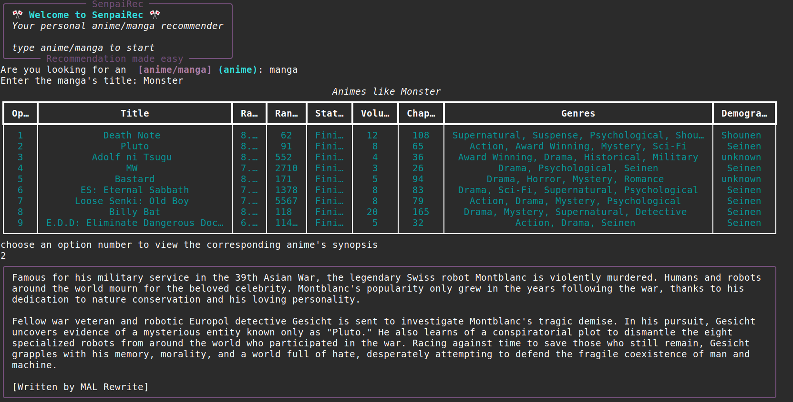

#SenpaiRec

A script that recommends anime or manga based on your selected title, displaying each suggestion in a clear format. <br>
Using the requests and BeautifulSoup libraries to fetch and parse content from MyAnimeList, and the rich library for console output.

<p align="center">
  
</p>


## Installation
Before you begin, make sure you have the following installed:

Python 3.8+

Git

(Optional) Virtual environment tool (venv or virtualenv)

### 1. Clone the Repository
```
git clone https://github.com/Mouheb-Mahfoudhi/SenpaiRec.git
cd SenpaiRec 
```
### 2. Create and Activate a Virtual Environment (recommended)
```
python3 -m venv venv
source venv/bin/activate    # On Linux/Mac
venv\Scripts\activate       # On Windows
```
### 3. Install Dependencies
```
pip install -r requirements.txt
```
### 4.Running the Application
```
python3 src/main.py        # On Linux/Mac
python src/main.py         # On Windows
```
